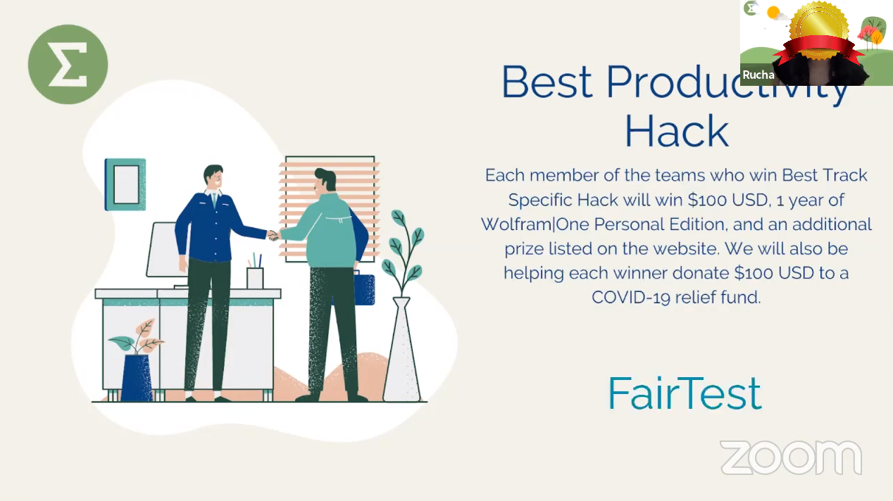

# FairTest 🔍
Welcome to the repository of FairTest, an award-winning project that brings creative solution to university/school online testing.
 

## Table of Content 📃
- [**Inspiration**](#inspiration)
- [**What it does?**](#does)
- [**Use of Softwares**](#use)
- [**Try FairTest**](#try)
- [**What's next?**](#next)
- [**Team & Contributors**](#team)
- [**Award**](#team)

## <a name = "inspiration">Inspiration 💭</a>
As university students, we noticed that when the education became remote due to COVID-19 pandemic, exams and tests went hard to be monitored by university/school. The issue appeared such that students became more inactive in terms of study and cheatings became hard to track, which is really unfair to all students. Therefore, we built FairTest from scratch, an online testing platform to solve this problem. Our project focuses on the productivity track on the hackathon and we believe that, providing a more fair and strict testing system will motivate the student to learn more actively online and behave in an honest manner on the tests/exams.

## <a name = "does">What it does ❓</a>
FairTest uses facial authentification to verify that the user in the camera is the one to be tested and uses cursor capture to help prevent cheating by getting help from external resources.

## <a name = "use">Use of Softwares 🛠</a>
- **Django** as Full-Stack Web Frame.
- **Python face-recognition** library provides essential functionalities to support our facial authentication.
- **Javascript** supports the cursor capture feature.

## <a name = "does">Try FairTest 🔧</a>
- To try FairTest, there are several python libraries needed to be installed, which are .

## <a name = "next">What's next ❓</a>
Since the project was built in a rush on the hackathon event, it is still under construction. We're still working on the following tasks:
- Database functionality updates.
- Smoothier dynamic camera display of facial authentication on the html page.
- Better UI design.
- Web deployment
 

## <a name = "team">Team & Contributors 👨‍👨‍👦</a>

| Team Member        | Role(s)                              | Contact Info           |
| ------------------- |--------------------------------------| ---------------------- |
| **Sida Wang**       | Full-Stack Developer | wangs132@mcmaster.ca   |
| **Wei Liu**    | Full-Stack Developer | liuw0407@gmail.com |
| **Deuce Cao**       | Front-End Developer                       | hq.cao1@gmail.com      |
| **Charles Zhang**       | Computer Vision Specialist                      | zhans22@mcmaster.ca     |

  

## <a name = "award">Award - Best Productivity Hack on [SigmaHacks 2.0](https://sigmahacks.org/) 🎉</a>
- [Our DevPost](https://devpost.com/software/fairtest) of the project on **SigmaHacks 2.0**
 

</img>

 

_[Last Edited 07/26/2020]_
